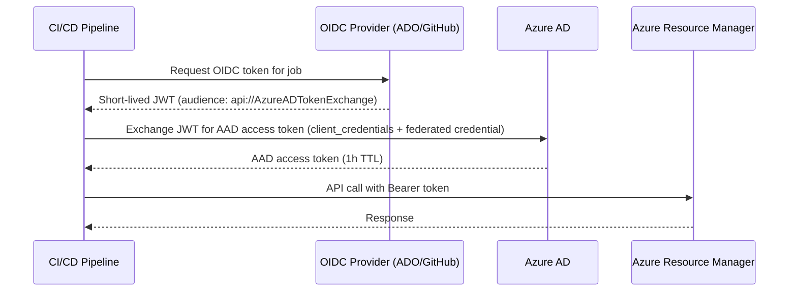

# Identity Model

## Overview

The Apex Platform uses a defence-in-depth identity strategy:

1. **Workload Identity** — Managed identities for all Azure workloads (no stored credentials).
2. **Group-based RBAC** — All role assignments target AAD security groups, not individual users.
3. **Workload Identity Federation (WIF)** — CI/CD pipelines authenticate using OIDC tokens; no service principal secrets.
4. **Privileged Identity Management (PIM)** — Elevated access is time-bound and requires justification.

## AAD Security Groups

| Group | Role | Scope |
|---|---|---|
| `grp-apex-platform-admins` | Owner | Platform Management Group |
| `grp-apex-platform-contributors` | Contributor | Platform Management Group |
| `grp-apex-landing-zone-owners` | Contributor | Landing Zones Management Group |
| `grp-apex-security-readers` | Security Reader | Root Management Group |
| `grp-apex-cost-managers` | Cost Management Reader | Root Management Group |

## RBAC Matrix

| Persona | Role | Scope |
|---|---|---|
| Platform Engineer | Contributor | Platform subscription |
| Application Developer | Contributor | Team landing zone |
| Security Analyst | Security Reader | Root |
| FinOps Analyst | Cost Management Reader | Root |
| CI/CD Pipeline (OIDC) | Contributor | Specific resource group |

## Managed Identity Strategy

Every workload module creates a user-assigned managed identity and assigns it the minimum required roles:

- Container Apps → Key Vault Secrets User on team Key Vault
- Function Apps → Storage Blob Data Owner on associated storage
- Secret rotation Function → Key Vault Secrets Officer on monitored vaults

Service principal passwords are **never** stored in pipelines or secrets. All pipeline authentication uses OIDC Workload Identity Federation.

## Workload Identity Federation Setup

1. Create an App Registration in Azure AD.
2. Add a federated credential:
   - **Issuer:** `https://token.actions.githubusercontent.com` (GitHub) or the ADO OIDC issuer.
   - **Subject:** `repo:<org>/<repo>:environment:production` (GitHub example).
3. Assign the service principal the Contributor role on the target subscription.
4. In the pipeline, use `azure/login@v2` (GitHub Actions) or the `AzureCLI@2` task with `addSpnToEnvironment: true` and no stored secret.

## OAuth2 Token Flow

