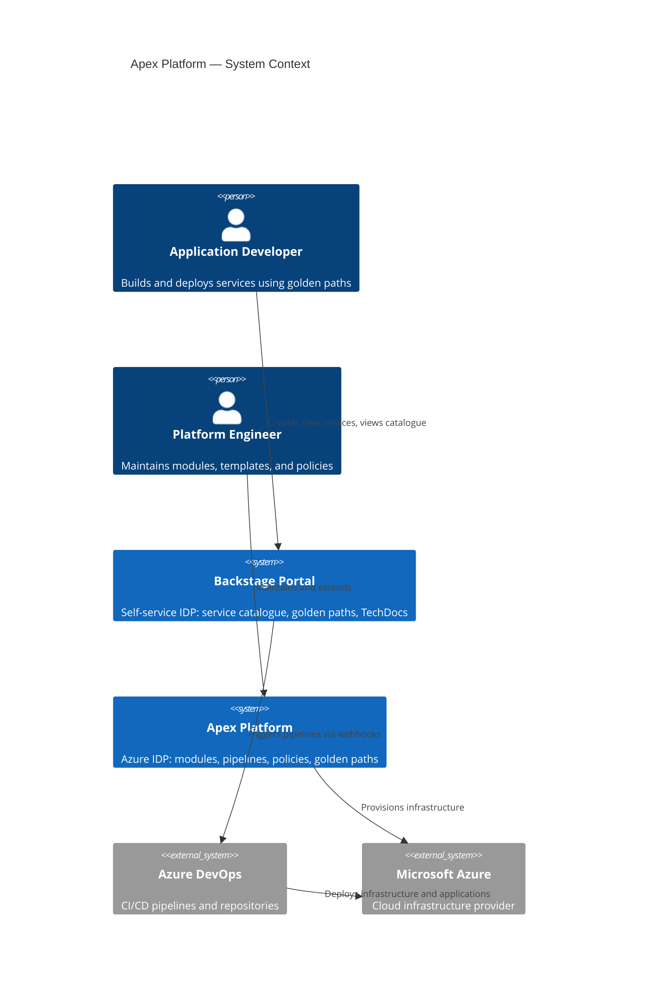

# Platform Overview

The Apex Platform is a production-grade Internal Developer Platform (IDP) for Azure. It accelerates application delivery by providing opinionated, pre-approved infrastructure modules, golden path project templates, and a self-service portal built on Backstage.

## Architecture Layers

The platform is organised into five layers:

| Layer | Responsibility |
|---|---|
| **Governance** | Management groups, Azure Policy, RBAC, and subscription structure |
| **Connectivity** | Hub VNet, Azure Firewall, Bastion, DNS, and VNet peering |
| **Landing Zones** | Per-team spoke VNets composed from reusable Terraform modules |
| **Platform Services** | Shared services: Key Vault, Container Registry, Log Analytics |
| **Application** | Golden path projects deployed into landing zones |

## C4 Context Diagram

## Module Catalogue

| Module | Purpose |
|---|---|
| `azure-container-app` | Containerised workloads on Azure Container Apps |
| `azure-key-vault` | Secrets management with RBAC and private endpoints |
| `azure-spoke-vnet` | Spoke VNet with NSGs, route tables, and hub peering |
| `azure-sql-database` | Azure SQL Database with private endpoint and backups |
| `azure-function-app` | Serverless functions (Consumption and Premium plans) |
| `azure-static-web-app` | React/Angular/Vue frontends on Azure Static Web Apps |
| `azure-budget` | Cost governance with alerting thresholds |
| `azure-secret-rotation` | Automated Key Vault secret rotation via Event Grid |
| `azure-landing-zone` | Composes spoke-vnet + budget + policy for a team |

## Golden Paths

| Template | Stack | Pipeline |
|---|---|---|
| `dotnet-microservice` | .NET 8, Container Apps | ADO + GitLab |
| `python-django-api` | Python 3.12, App Service | ADO + GitLab |
| `react-frontend` | React 18, Static Web Apps | ADO + GitLab |
